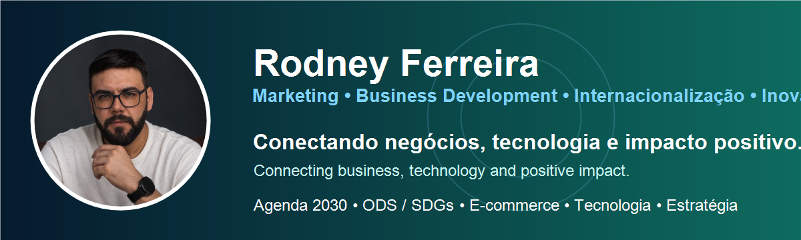
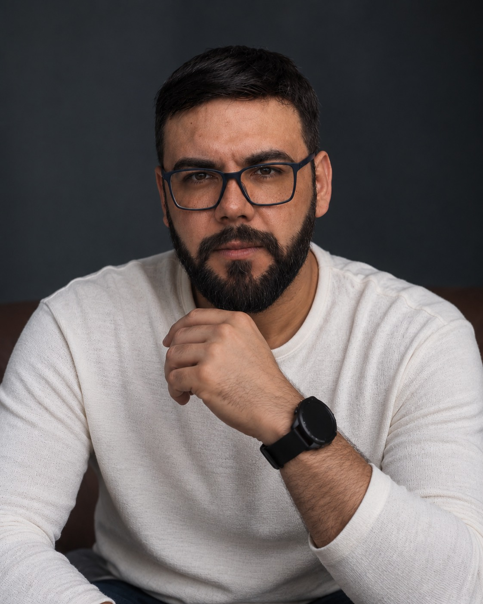

  

<h1 align="center">Olá, eu sou Rodney Ferreira 👋 | Hi, I'm Rodney Ferreira</h1>

  

  <strong>Marketing • Business Development • Internacionalização • Inovação • Tecnologia</strong>

  
  
  

Profissional com mais de 15 anos de experiência em áreas comerciais e de marketing, conectando estratégia, negócios, tecnologia, inovação, relações institucionais e internacionalização.

Professional with 15+ years of experience in commercial and marketing roles, connecting strategy, business, technology, innovation, institutional relations and internationalization.

---

## 👤 Atuação atual | Current roles

- 🌐 **Sócio-fundador da Ego Criativo | Co-founder at Ego Criativo**
- 🤝 **Diretor de Relações Institucionais da Coutinho Companhia | Institutional Relations Director at Coutinho Companhia**
- 🌱 **Coordenador de Comunicação do Movimento Nacional ODS MS | Communications Coordinator at Movimento Nacional ODS MS**
- 🇧🇷 **Conselheiro Nacional do Movimento Nacional ODS | National Council Member at Movimento Nacional ODS**

[Conheça minha atuação no Movimento Nacional ODS →](https://movimentoods.org.br/mato-grosso-do-sul/)

## 🇧🇷 Sobre mim

- 📍 Salto, São Paulo, Brasil
- 💼 Marketing, Desenvolvimento de Negócios e Relações Institucionais
- 🌎 Internacionalização de empresas e expansão de mercados
- 📈 Geração de leads, planejamento estratégico, marketing de performance e conteúdo
- 🛒 E-commerce, marketplaces, CRM e automação comercial
- 🤝 Conexão entre empresas, universidades e ecossistemas de inovação
- 🌱 Sustentabilidade, Agenda 2030 e Objetivos de Desenvolvimento Sustentável (ODS)
- 🎓 Formação pela Universidade Federal de Mato Grosso do Sul — UFMS

## 🇺🇸 About me

- 📍 Salto, São Paulo, Brazil
- 💼 Marketing, Business Development & Institutional Relations
- 🌎 Business internationalization and market expansion
- 📈 Lead generation, strategic planning, performance marketing and content
- 🛒 E-commerce, marketplaces, CRM and sales automation
- 🤝 Connecting companies, universities and innovation ecosystems
- 🌱 Sustainability, UN 2030 Agenda and Sustainable Development Goals (SDGs)
- 🎓 Universidade Federal de Mato Grosso do Sul — UFMS

## 🧰 Ferramentas & competências | Tools & skills

  
  
  
  
  
  
  
  
  
  

## 🎓 Certificações em destaque | Selected certifications

- ApexBrasil — Plano de Expansão Internacional
- Pipedrivers — Pipedrive CRM
- Companhia Pablo Cabral — Master of Google Ads
- Anprotec — Implantação CERNE 1 e 2

## 🤝 Atuação social e institucional | Community & institutional involvement

- Movimento Nacional ODS — comunicação, articulação institucional e Agenda 2030
- Junior Achievement — voluntariado em educação empreendedora
- Conaje — atuação em redes de jovens empresários
- StartupMS — liderança em ecossistema de startups

## 🎤 Palestras & conteúdo | Talks & content

- Marketing e posicionamento para o mercado externo
- Internacionalização de empresas
- Estratégia comercial, marketing e geração de leads
- Sustentabilidade, Agenda 2030 e ODS

## 🚀 Projeto em destaque | Featured project

### Controle de Estoque
Aplicação web desenvolvida com **Nuxt 4, Vue 3, TypeScript, Supabase e Tailwind CSS**, publicada na Vercel.

Web application built with **Nuxt 4, Vue 3, TypeScript, Supabase and Tailwind CSS**, deployed on Vercel.

- 🌐 Demo: https://controle-de-estoque1.vercel.app
- 💻 Código: https://github.com/rodneyjuniorms/controle_de_estoque

## 📊 GitHub

  
  

## 🌐 Idiomas | Languages

- Português — nativo / native
- English — intermediate
- Español — intermediate

## 📫 Contato | Contact

- LinkedIn: https://www.linkedin.com/in/rodneyjunior/
- GitHub: https://github.com/rodneyjuniorms

---

> Aberto a conexões profissionais, projetos, inovação, negócios, internacionalização e impacto sustentável.  
> Open to professional connections, projects, innovation, business, internationalization and sustainable impact.
