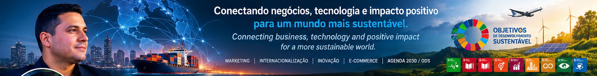
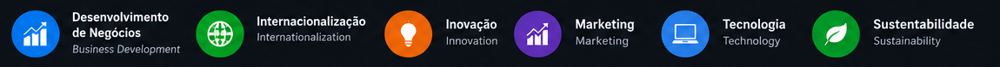
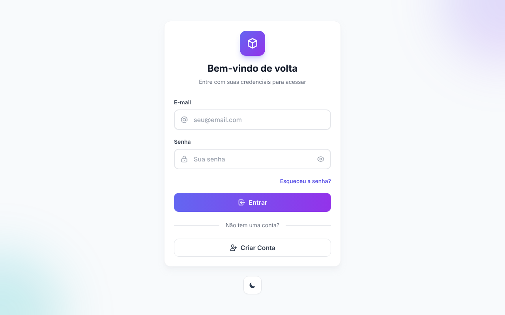

  

<table>
<tr>
<td width="50%" valign="top">

## 👋 Olá, eu sou o Rodney!

Sou profissional de **Marketing, Desenvolvimento de Negócios e Internacionalização**, com mais de **15 anos de experiência** conectando empresas, inovação e impacto positivo.

Atuo com estratégia, tecnologia e parcerias para gerar oportunidades reais de crescimento no Brasil e no exterior, sempre alinhado à **Agenda 2030** e aos **Objetivos de Desenvolvimento Sustentável (ODS)**.

</td>
<td width="50%" valign="top">

## 👋 *Hi, I'm Rodney!*

*I am a **Marketing, Business Development and Internationalization** professional, with over **15 years of experience** connecting companies, innovation and positive impact.*

*I work with strategy, technology and partnerships to create real growth opportunities in Brazil and abroad, always aligned with the **2030 Agenda** and the **Sustainable Development Goals (SDGs)**.*

</td>
</tr>
</table>

  

  
  
  
  

---

<table>
<tr>
<td width="62%" valign="top">

### 🧩 Tecnologias / *Technologies*

    
  

  
  
  
  
  

</td>
<td width="38%" valign="top">

### 📊 GitHub Stats

</td>
</tr>
</table>

  

---

<table>
<tr>
<td width="38%" valign="top">

### 🏠 Projeto em destaque
*Featured project*

**[controle_de_estoque](https://github.com/rodneyjuniorms/controle_de_estoque)**

Sistema de controle de estoque moderno desenvolvido com Nuxt 4, Vue 3, TypeScript, Supabase e Tailwind CSS.

*Modern inventory management system built with Nuxt 4, Vue 3, TypeScript, Supabase and Tailwind CSS.*

`nuxt` `vue` `typescript` `supabase` `tailwindcss` `vercel` `inventory`

🌐 [Demo](https://controle-de-estoque1.vercel.app) · 💻 [Ver repositório →](https://github.com/rodneyjuniorms/controle_de_estoque)

</td>
<td width="31%" valign="top">

### 🏛️ Atuação institucional
*Institutional work*

🌱 **[Movimento Nacional ODS](https://movimentoods.org.br/mato-grosso-do-sul/)** 
Comunicação, articulação e projetos para os Objetivos de Desenvolvimento Sustentável.

🌎 **[ABIPI](https://abipi.org.br)** 
Agência Brasileira de Internacionalização, Pesquisa e Inovação.

🎨 **Ego Criativo** 
Marketing, estratégia e projetos digitais.

🤝 **Coutinho Companhia** 
Relações institucionais.

</td>
<td width="31%" valign="top">

### 📌 Principais temas
*Key topics*

🌐 **Internacionalização de empresas** *Internationalization of companies*

📈 **Marketing e geração de leads** *Marketing and lead generation*

🛒 **E-commerce e marketplaces** *E-commerce and marketplaces*

💡 **Inovação e transformação digital** *Innovation and digital transformation*

🌱 **Sustentabilidade e Agenda 2030 / ODS** *Sustainability and 2030 Agenda / SDGs*

🎤 **Palestras, eventos e networking** *Lectures, events and networking*

</td>
</tr>
</table>

---

<table>
<tr>
<td width="50%" valign="top">

### 👤 Atuação atual | *Current roles*

- 🌐 Sócio-fundador da **Ego Criativo** | *Co-founder*
- 🤝 Diretor de Relações Institucionais da **Coutinho Companhia** | *Institutional Relations Director*
- 🌱 Coordenador de Comunicação do **Movimento Nacional ODS MS** | *Communications Coordinator*
- 🇧🇷 Conselheiro Nacional do **Movimento Nacional ODS** | *National Council Member*

### 🎓 Certificações | *Certifications*

- ApexBrasil — Plano de Expansão Internacional
- Pipedrivers — Pipedrive CRM
- Companhia Pablo Cabral — Master of Google Ads
- Anprotec — Implantação CERNE 1 e 2
- 🎓 Universidade Federal de Mato Grosso do Sul — UFMS

</td>
<td width="50%" valign="top">

### 🤝 Atuação social | *Community*

- Movimento Nacional ODS — Agenda 2030
- Junior Achievement — educação empreendedora
- Conaje — redes de jovens empresários
- StartupMS — ecossistema de startups

### 🎤 Palestras | *Talks*

- Marketing e posicionamento para o mercado externo
- Internacionalização de empresas
- Estratégia comercial, marketing e geração de leads
- Sustentabilidade, Agenda 2030 e ODS

### 🌐 Idiomas | *Languages*

🇧🇷 Português — nativo / *native* 
🇺🇸 English — intermediate 
🇪🇸 Español — intermediate

</td>
</tr>
</table>

---

  <b>Aberto a conexões profissionais, projetos, inovação, negócios, internacionalização e impacto sustentável.</b> 
  <i>Open to professional connections, projects, innovation, business, internationalization and sustainable impact.</i>

  
  

